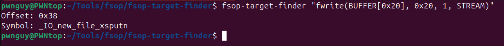
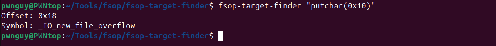
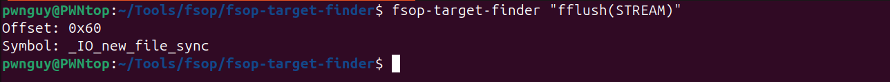
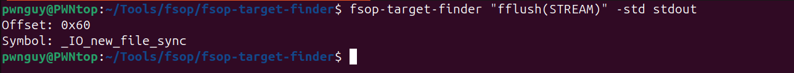
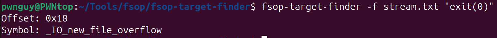

# FSOP TARGET FINDER
## Tool Description
This tool want to automate part of the process of FILE struct exploitation.
When we want to hijack control flow exploiting FILE struct we often rely on vtables attack.
Basically it consist on overwriting the vtable pointer to control what function will be called.
To do this we have to know what function the program is calling. We can identify the function by the offset
from the vtable pointer. This offset depends on what function is calling and on some properties of stream that is being used. 

So the attack consist in poisoning the FILE struct and then call a function which rely on FILE stream and on their vtable.
Almost always the attacker has to dive into the libc source and understand what function will be called from the vtable. This isn't a quick process but it can be partially automated.

This tool goal is to understand what function is called for you. So you'll be able to skip all the libc study part and just use the offset given by the tool

I want to underline that the tool can't always replace the manual work, if there are some particular conditions that have to be satisfied the tool will not tell you what they are. But given a FILE struct and a function the tool is very good at telling what will be called from the vtable.

## How to install
To install the tool you just need to launch `install.sh`. It's not necessary to clone all the repo, the file that you need are `main.py`, `gdb_daemon.py` and `target` and if you want to install it automatically `install.sh` (it just creates a simlink)

## How to use
```
usage: fsop-target-finder [-h] [-s STREAM] [-f STREAM_FILE] [-std {stdin,stdout,stderr}] [--interface] [--libc LIBC] [--linker LINKER] target

Given a libc function which act on file stream, this tool should retrive the offset of the vtable function
called. The goal is to make FILE struct exploitation easier by avoiding to dive into libc source code

positional arguments:
  target                The target function call passed as function(arg1, arg2, ...)
                        function: The target function
                        arg[number] Can be an hardcoded value or one of the following alias:
                        BUFFER[SIZE]    replace the argument with the address of a buffer allocated using malloc(SIZE)
                        BUFFER          alias for BUFFER[0x10]
                        STREAM          replace the argument with the address of the file stream
                        
                        To get the vtable function called the tool will call the target function using the given template

options:
  -h, --help            Show this help message and exit
                        
  -s STREAM, --stream STREAM
                        The FILE stream which will be passed to the target function call
                        The stream has to be passed as a json (you can obtain the ideal formatting by using json.dumps(dictionary) in python)
                        This json has to be an implementation of a specific interface.
                        You can get the interface using fsop-target-finder --interface
                        
                        It's possible to not include all the fields.
                        In that case the omitted fields will have the value of the stream generated with fopen(file_name, "rw")
                        
                        Example:
                        fsop-target-finder fwrite(BUFFER, 0x10, 0x1, STREAM) -s '{"_flags": 0xfbad0000, "_IO_read_ptr": 0xdeadbeef}'
                        
                        If omitted it will be replaced with stderr
                        
  -f STREAM_FILE, --stream-file STREAM_FILE
                        The path of a file containing a json representing the FILE stream
                        The json sohuld be an implementation of a specific interface.
                        You can get the interface by using fsop-target-finder --interface
                        
  -std {stdin,stdout,stderr}, --standard-stream {stdin,stdout,stderr}
  --interface           Get the interface of the object passed via --stream or --stream-file
                        
  --libc LIBC           Path to the libc used by the binary
                        If omitted the system libc will be used /lib/x86_64-linux-gnu/libc.so.6
                        
  --linker LINKER       Path to the dynamic loader used by the binary
                        If omitted the system loader will be used /lib/x86_64-linux-gnu/ld-linux-x86-64.so.2

```

The tool can use a custom libc and dynamic loader to launch the binary with. If not given they will try to find libc and ld in /lib/x86_64-linux-gnu/

There is only one positional argument which is the target function, e.g. the one that should call the vtable function and fire the exploit. The function has to be passed with its arguments, because they could change the function behaviour. It's possible to pass hardcoded integer, buffers, and a FILE stream (it will cover most of the functions). To pass this values we can use the following syntax:

- Define the call with function(arg1, arg2, ...)
- To pass integer we just have to write them (either in base 10 or 16)
- To pass a buffer we can use the keyword BUFFER, this will pass a 0x10 bytes buffer. If we want to specify a size we can do it using the keyword BUFFER\[SIZE\] (size can be either base 10 or base 16). These keywords will allocate the buffer and pass a pointer to the top of it. If we use it multiple time the tool will allocate multiple buffers
- To pass the stream we can use the keyword STREAM

Examples:






By default the stream passed its stderr. If we want to use one of the standard streams (stdin, stdout, stderr) we can quickly do it by the option -std / --standard-stream stream_name. So if we want to fflus(stdout) we can simply use



It's also possible to pass a custom stream. The stream is built by calling fopen(file, "rw"), the file used is a txt file used by the tool to comunicate with `gdb_daemon.py` (be aware, it is not a real daemon. I just run out of fantasy).
Custom streams has to be passed as json, implementing a specific interface. We can give a look to the interface by the command
```sh
fsop-target-finder --interface

class Stream(TypedDict):
    _flags : int
    _IO_read_ptr : int
    _IO_read_end : int
    _IO_read_base : int
    _IO_write_base : int
    _IO_write_ptr : int
    _IO_write_end : int
    _IO_buf_base : int
    _IO_buf_end : int
    _IO_save_base : int
    _IO_backup_base : int
    _IO_save_end : int
    _markers : int
    _chain : int
    _fileno : int
    _flags2 : int
    _old_offset : int
    _cur_column : int
    _vtable_offset : int
    _shortbuf : int
    _lock : int
    _offset : int
    _codecvt : int
    _wide_data : int
    _freeres_list : int
    _freeres_buf : int
    __pad5 : int
    _mode : int
    _unused2 : bytes
    vtable : int

```

We don't need to fully implement it, it's possible to implement just some properties and the others will remain the one setted by default with the fopen call.
The strem can be passed inline or as a file
```sh
fsop-target-finder -s {inline file stream} target(args)
fsop-target-finder -f {/path/to/file} target(args)
```

P.S. -f, -s and -std are mutually exclusive. If we try to use them together the tool will stop you.

## The exit() case
One of the most usefull targets its the exit() function. You can notice that running the tool on exit with defaualt option will not give any result. This happen becouse the exit not always call vtable functions. That's why at the top of this docs I said that this tool doesn't fully replace manual work.

First of all we are intersted on what function which interact with file stream the exit call. It's not very easy to look at it directly in the libc source, luckly debugging the exit with gdb is enough. The plan is to run any binary which is linked to a libc, break on exit and then just let it exit. It's also possible to call exit directly from gdb. Then we just step in until we see some stream function.

After a little bit of step in we found ourself in `_IO_cleanup`. Here it is the back trace:
```
__GI_exit -> __run_exit_handlers -> _IO_cleanup
```
If you want to know the correspondence in the libc source, in the `__run_exit_handlers` function we can find the following snippet
```c
if (run_list_atexit)
    call_function_static_weak (_IO_cleanup);
```

Now if we dive into the `_IO_cleanup` we see that it basically is a wrapper for `_IO_flush_all`
```c
int
_IO_cleanup (void)
{
  int result = _IO_flush_all ();
  _IO_unbuffer_all ();

  return result;
}
```
And if we dive into `_IO_flush_all` we will finally find something useful
```c
if (((fp->_mode <= 0 && fp->_IO_write_ptr > fp->_IO_write_base) ||
     (_IO_vtable_offset (fp) == 0 && fp->_mode > 0 && 
     (fp->_wide_data->_IO_write_ptr > fp->_wide_data->_IO_write_base))
    ) && _IO_OVERFLOW (fp, EOF) == EOF)
```
This snippet it's located inside a for loop wich iterati over all the fp, strating from `_IO_list_all`

`_IO_OVERFLOW` wrap a call to a vtable function. This called is in a conditional statement after an && operator. So to execute that call the condition before the && operator must evaluate `True`.

To achieve this goal we can manipulate the FILE stream such that it satisfy `fp->_mode <= 0 && fp->_IO_write_ptr > fp->_IO_write_base` or `_IO_vtable_offset (fp) == 0 && fp->_mode > 0 && (fp->_wide_data->_IO_write_ptr > fp->_wide_data->_IO_write_base)` or both conditions. Personally I prefer the first one (becouse it's simpler).

Now we know how to use the tool on exit. We just have to craft a custom stream which satisfy these conditions. I used the following stream
```
{
 "_flags": 0,
 "_IO_read_ptr": 0,
 "_IO_read_end": 0,
 "_IO_read_base": 0,
 "_IO_write_base": 0,
 "_IO_write_ptr": 1,
 "_IO_write_end": 0,
 "_IO_buf_base": 0,
 "_IO_buf_end": 0,
 "_IO_save_base": 0,
 "_IO_backup_base": 0,
 "_IO_save_end": 0,
 "_mode" : 0,
}
```
Now we can run the tool and get the offset


You could be wondering how the tool has been usefull in this case. We had to dive into libc and understand what function was called by ourself.

Firs of all we safe some minutes by avoiding looking for the offset of that function from the vtable pointer (We would have to dive into the `struct _IO_jump_t`)

The most important reason is that this offset could change from one libc version to another. But rarely the logic of the exit will completely change. A little change in the offset would completly mess up the exploit while a little change on the exit logic would not. Now that we know what the conditions are, and we've built a custom stream wich trigger that call, we can just keep this custom stream and use each time we approch to a different libc. In this way we can istantly get the right offset, avoiding diving on each version of the libc.

## Warnigs
If a vtable function is called from a different stream of the given one the tool will not notice the difference and we will get an unexpected result. So we have to be carefull to false positive.

Example:
```sh
stream.txt
{
 "_flags": 0,
 "_IO_read_ptr": 0,
 "_IO_read_end": 0,
 "_IO_read_base": 0,
 "_IO_write_base": 0,
 "_IO_write_ptr": 0,
 "_IO_write_end": 0,
 "_IO_buf_base": 0,
 "_IO_buf_end": 0,
 "_IO_save_base": 0,
 "_IO_backup_base": 0,
 "_IO_save_end": 0,
 "vtable": 0xbadc0ffe
}


fsop-target-finder "putchar(0x10)" -f stream.txt 
Offset: 0x7fff3d04104a
Symbol: _IO_new_file_overflow
```
It happens that the tool intercept the call to the vtable of stdout, done by putchar, and then it will calculate the offset using the vtable given in the custom stream. Even if you get the right offset, the call was done from the stdout stream, so poisoning the custom stream vtable will not have any effect.